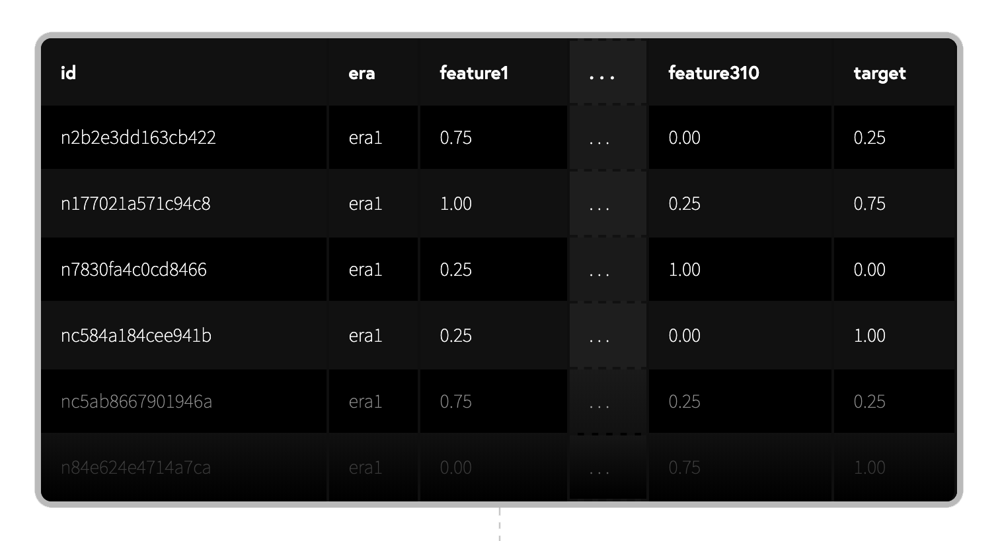

# Stock Market Prediction with Machine Learning

# Introduction

Build machine learning models on abstract financial data (provided by Numer.ai) to predict the stock market. 

Models can be staked with NMR cryptocurrency to earn rewards based on performance.

---

## Summary

- Download the dataset with training data and example scripts
- Build your model and submit your predictions back to Numerai
- Stake NMR on your models to earn/burn based on performance
- Automate your weekly submissions and grow your stake over time

---

## Data

Numerai provides a free dataset of high quality financial data that has been cleaned, regularized, and obfuscated.



- `id` represents a stock at a certain time `era`
- `feature` describes a quantitative attribute of a stock at that time.
- `target` represent an abstract measure of performance ~4 weeks into the future

# Modeling

<aside>
💡 Build a model to predict the future target using live features that correspond to the current stock market.

</aside>

We train the model using historical training data, and make predictions on the live tournament data.

```python
import pandas as pd
from xgboost import XGBRegressor

# training data contains features and targets
training_data = pd.read_csv("numerai_training_data.csv").set_index("id")

# tournament data contains features only
tournament_data = pd.read_csv("numerai_tournament_data.csv").set_index("id")
feature_names = [f for f in training_data.columns if "feature" in f]

# train a model to make predictions on tournament data
model = XGBRegressor(max_depth=5, learning_rate=0.01, \
                     n_estimators=2000, colsample_bytree=0.1)
model.fit(training_data[feature_names], training_data["target"])

# submit predictions to numer.ai
predictions = model.predict(tournament_data[feature_names])
predictions.to_csv("predictions.csv")
```

# Scoring

You are scored on the correlation (`corr`) between your predictions and the targets. Higher correlation is better.

You are also scored on your [meta model contribution](https://docs.numer.ai/tournament/metamodel-contribution) (`mmc`) and [feature neutral correlation](https://docs.numer.ai/tournament/feature-neutral-correlation)
 (`fnc`). The higher the meta model contribution and feature neutral correlation the better.

Each submission will be scored over the ~4 week duration of the round. Submissions will receive its first score starting on the Thursday after the Monday deadline and final score on Wednesday 4 weeks later for a total of 20 scores.

```python
# method='first' breaks ties based on order in array
ranked_predictions = predictions.rank(pct=True, method="first")
correlation = np.corrcoef(labels, ranked_predictions)[0, 1]
```

Your model's live scores can be viewed publicly on its model profile page. Here is an example of a model's final scores over the past 20 rounds.


You can also zoom in to a specific round and see the 20 daily scores within the round.


# Payout

Staked models of Numerai are combined to form the Meta Model which controls the capital of the Numerai hedge fund across the stock market.

Staking the NMR cryptocurrency on your models lets you **earn (or burn) NMR based on your model’s CORR or MMC scores**

- This is the only way to earn rewards from the Numerai tournament.

**Payouts are a function of your stake value and scores**
The higher your stake value and the higher your scores, the more you will earn. 

If you have a negative score, then a portion of your stake will be burned. 

- Payouts and burns are respectively limited to +25% and -25% of the stake value per round.

```python
payout = stake_value * payout_factor * (corr * corr_multiplier + mmc * mmc_multiplier)
```

The *payout factor* is a number that scales with the total NMR staked across all models by all users in the tournament. The higher the total NMR staked, the lower the payout factor.

Payouts are made at the resolution of each round. You can choose whether you want your payouts to compound into your stake or get paid out to your wallet every roundi.